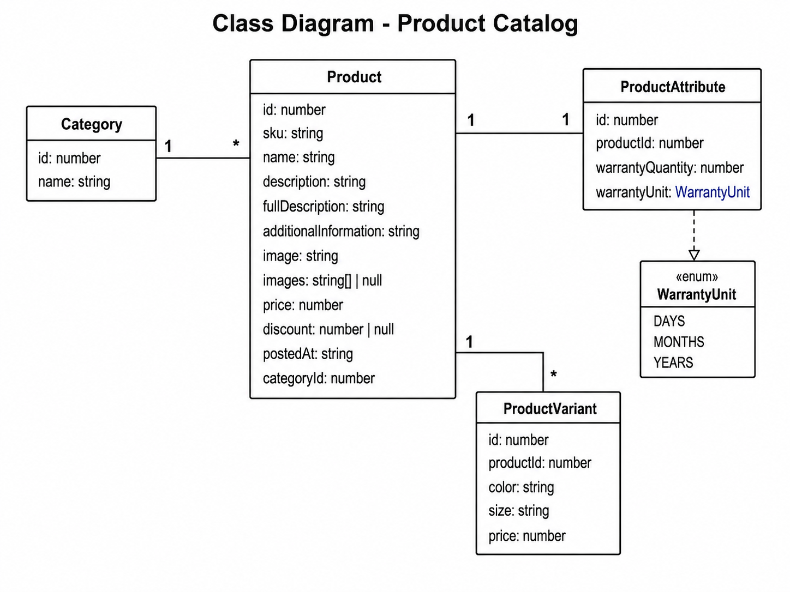

# 🛋️ Furniro

> 📖 [Portuguese version](README.md) | English Version

Full-Stack furniture e-commerce application built with **React**, **NestJS**, **TypeScript**, and **SQLite**, following modern development best practices, including layered architecture, component-based design, static typing, and clean code principles.

<div align="center">


</div>

---

# 📖 About the Project

**Furniro** is a Full-Stack application that simulates a modern furniture e-commerce platform.

The project was developed to reproduce common features found in real-world online stores, using a decoupled frontend and backend architecture, REST API communication, and relational database persistence.

The frontend was built with **React**, **TypeScript**, **Vite**, and **Tailwind CSS**, providing a modern, responsive, and component-based user interface.

The backend uses **NestJS**, **TypeORM**, and **SQLite**, exposing a REST API responsible for managing products, categories, variants, and attributes.

The application was designed with a focus on:

- ✅ Modern Full-Stack architecture
- ✅ Separation of concerns
- ✅ Strong static typing with TypeScript
- ✅ Componentization and code reuse
- ✅ Layered backend architecture
- ✅ REST API communication
- ✅ Scalable code organization
- ✅ Docker-based development environment
- ✅ Data persistence with SQLite
- ✅ DTOs, Mappers, and Repositories to decouple the domain layer

---

# ✨ Features

## 🛍️ Online Store

- Complete product catalog
- Individual product page
- Category navigation
- Related products
- Shopping cart
- Quantity selection
- Product variant selection
- Color selection
- Size selection
- Discount display
- Recently added products
- Detailed product information

---

## 🔍 Catalog

- Paginated product listing
- API-based pagination
- Product sorting
- Category filters
- Price filters
- Discount filters
- Product name search
- URL query parameter filtering

---

## 🎨 User Interface

- Fully responsive layout
- Hero section
- Browse The Range section
- Inspiration carousel
- Image gallery
- Toast notifications
- 404 page
- Page navigation
- Reusable components
- SVG icons
- Animations and transitions

---

## 🛒 Shopping Cart

- Add products
- Update quantities
- Remove products
- Local Storage persistence
- Global state management with Zustand

---

## ⚙️ Backend

- REST API
- Pagination
- Dynamic filtering
- Sorting
- DTOs
- Automatic validation
- Repositories
- Services
- Mappers
- Automatic database seeding
- SQLite database

# 🛠️ Technologies

## Frontend

| Technology      | Purpose                        |
| --------------- | ------------------------------ |
| React 19        | User interface development     |
| TypeScript      | Static typing                  |
| Vite            | Bundler and development server |
| Tailwind CSS v4 | Styling                        |
| React Router    | Routing                        |
| Zustand         | Global state management        |
| React Toastify  | Notifications                  |
| Splide          | Carousels                      |

---

## Backend

| Technology        | Purpose               |
| ----------------- | --------------------- |
| NestJS            | Backend framework     |
| TypeScript        | Programming language  |
| TypeORM           | ORM                   |
| SQLite            | Database              |
| Class Validator   | DTO validation        |
| Class Transformer | Object transformation |

---

## Infrastructure

| Technology     | Purpose                 |
| -------------- | ----------------------- |
| Docker         | Containerization        |
| Docker Compose | Container orchestration |
| Node.js        | Runtime environment     |

# 🏗️ Architecture

The project is organized as a **monorepo**, clearly separating the responsibilities between the frontend and backend.

```text
                ┌───────────────────────────────┐
                │          Frontend             │
                │        React + Vite           │
                └──────────────┬────────────────┘
                               │
                          HTTP / REST
                               │
                               ▼
                ┌───────────────────────────────┐
                │          Backend              │
                │           NestJS              │
                └──────────────┬────────────────┘
                               │
                           TypeORM
                               │
                               ▼
                ┌───────────────────────────────┐
                │          SQLite               │
                └───────────────────────────────┘
```

The frontend communicates exclusively with the REST API provided by the backend.

All data access logic is centralized in the NestJS application, which is responsible for querying the database, applying filters and pagination, and transforming entities before sending them to the client.

---

## Backend Architecture

The backend follows a layered architecture, promoting low coupling and high maintainability.

```text
Controller
     │
     ▼
Service
     │
     ▼
Repository
     │
     ▼
TypeORM
     │
     ▼
SQLite
```

Each layer has a specific responsibility:

- **Controller**
    - Receives HTTP requests.
    - Validates request parameters.
    - Delegates requests to the Services.

- **Service**
    - Implements business rules.
    - Coordinates queries and data transformations.

- **Repository**
    - Centralizes database access.
    - Implements filtering, pagination, and sorting.

- **Mapper**
    - Converts database entities into DTOs returned by the API.

- **DTO**
    - Defines the API contract.
    - Prevents direct exposure of database entities.

---

# 📂 Project Structure

```text
/
├── CONTRIBUTING.en.md
├── CONTRIBUTING.md
├── docker-compose.yml
├── LICENSE
├── README.en.md
├── README.md
├── SECURITY.en.md
├── SECURITY.md
├── furniro-back-end/
│   ├── Dockerfile
│   ├── eslint.config.mjs
│   ├── nest-cli.json
│   ├── package.json
│   ├── README.md
│   ├── tsconfig.build.json
│   ├── tsconfig.json
│   └── src/
│       ├── app.controller.ts
│       ├── app.module.ts
│       ├── main.ts
│       ├── category/
│       │   ├── category.entity.ts
│       │   ├── category.module.ts
│       │   └── dto/
│       │       └── category.dto.ts
│       ├── database/
│       │   └── seed.ts
│       └── product/
│           ├── product.controller.ts
│           ├── product.module.ts
│           ├── product.service.ts
│           ├── dto/
│           │   ├── product-attribute.dto.ts
│           │   ├── product-details.dto.ts
│           │   ├── product.dto.ts
│           │   ├── product-variant.dto.ts
│           │   └── products-filters.dto.ts
│           ├── entities/
│           │   ├── product-attribute.entity.ts
│           │   ├── product-variant.entity.ts
│           │   └── product.entity.ts
│           ├── mappers/
│           │   └── product.mapper.ts
│           └── repositories/
│               └── product.repository.ts
└── furniro-web/
    ├── Dockerfile
    ├── eslint.config.js
    ├── index.html
    ├── package.json
    ├── README.en.md
    ├── README.md
    ├── tsconfig.app.json
    ├── tsconfig.json
    ├── tsconfig.node.json
    ├── vite.config.ts
    ├── db/
    │   └── db.json
    ├── public/
    │   ├── icons/
    │   └── img/
    │       ├── grid/
    │       └── products/
    └── src/
        ├── App.tsx
        ├── index.css
        ├── main.tsx
        ├── api/
        │   └── api.ts
        ├── components/
        │   ├── Badge.tsx
        │   ├── BannerContainer.tsx
        │   ├── BreadcrumbProduct.tsx
        │   ├── BrowseSection.tsx
        │   ├── Carrousel.tsx
        │   ├── CarrouselSlide.tsx
        │   ├── CartButton.tsx
        │   ├── CartTotals.tsx
        │   ├── Container.tsx
        │   ├── FeaturesSection.tsx
        │   ├── FilterBar.tsx
        │   ├── Footer.tsx
        │   ├── FormNewsletter.tsx
        │   ├── FuniroFurnitureSection.tsx
        │   ├── Header.tsx
        │   ├── Hero.tsx
        │   ├── InfinityGallery.tsx
        │   ├── InspirationSection.tsx
        │   ├── Layout.tsx
        │   ├── Logo.tsx
        │   ├── MainBtn.tsx
        │   ├── Nav.tsx
        │   ├── Pagination.tsx
        │   ├── PrincipalGrid.tsx
        │   ├── ProductCard.tsx
        │   ├── ProductCardSkeleton.tsx
        │   ├── ProductGallery.tsx
        │   ├── ProductImageThumbnail.tsx
        │   ├── ProductMainImage.tsx
        │   ├── ProductsSection.tsx
        │   ├── UserAndCartIcon.tsx
        │   └── product-details/
        │       ├── ProductDetailsContainer.tsx
        │       ├── ProductInfo.tsx
        │       └── ...
        ├── data/
        │   ├── grid.ts
        │   └── slides.ts
        ├── hooks/
        │   ├── get-product.ts
        │   └── get-products.ts
        ├── models/
        │   ├── PaginatedResponseModel.ts
        │   ├── ProductAttributeModel.ts
        │   ├── ProductCategory.ts
        │   ├── ProductDetailModel.ts
        │   ├── ProductFilterModel.ts
        │   ├── ProductModel.ts
        │   ├── ProductResponseModel.ts
        │   ├── ProductVariantModel.ts
        │   └── slide.ts
        ├── pages/
        │   ├── Cart.tsx
        │   ├── Home.tsx
        │   ├── NotFound.tsx
        │   ├── Product.tsx
        │   └── Shop.tsx
        ├── services/
        │   ├── api.ts
        │   └── ProductService.ts
        ├── store/
        │   └── cartStore.ts
        └── types/
            └── splide.d.ts
```

## Frontend Organization

The frontend structure follows the **separation of concerns** principle:

- **components/** → Reusable UI components
- **pages/** → Application pages
- **services/** → API communication layer
- **hooks/** → Custom React hooks
- **store/** → Global state management with Zustand
- **models/** → TypeScript contracts and models
- **api/** → HTTP client configuration

---

## Backend Organization

The backend is organized into modules.

Each module encapsulates its own entities, DTOs, repositories, services, and controllers, ensuring high cohesion and making the application easier to maintain and extend.

The data access layer is isolated through **Repositories**, while **Services** encapsulate all business logic and **Controllers** are responsible solely for handling HTTP requests.

# 📊 Data Model

The backend is modeled using **TypeORM** with **SQLite** for data persistence, organizing the data into related entities.

The data model was designed to support the evolution of the product catalog, allowing a single product to have multiple variants, attributes, and belong to a category.

---

## Entity Relationship Diagram



---

# 🌐 REST API

All communication between the frontend and backend takes place through a REST API built with NestJS.

The frontend does not access the database directly. Instead, it exclusively consumes the endpoints exposed by the backend application.

---

## Base URL

```text
http://localhost:3000
```

On the frontend, the API URL is configured through the following environment variable:

```env
VITE_API_URL=http://localhost:3000
```

---

# 📌 Endpoints

## Health Check

Returns a message indicating that the API is running.

### Request

```http
GET /
```

---

## List Products

Returns the registered products, applying filtering, pagination, and sorting.

### Request

```http
GET /products
```

### Query Parameters

| Parameter   | Type          | Description       |
| ----------- | ------------- | ----------------- |
| page        | number        | Requested page    |
| limit       | number        | Items per page    |
| name        | string        | Search by name    |
| category    | string        | Product category  |
| price_gte   | number        | Minimum price     |
| price_lte   | number        | Maximum price     |
| discount    | number        | Exact discount    |
| discount_gt | number        | Minimum discount  |
| sort        | string        | Sorting field     |
| order       | `asc \| desc` | Sorting direction |

---

### Examples

```http
GET /products?page=1&limit=8
```

```http
GET /products?category=Dining
```

```http
GET /products?price_gte=500&price_lte=1000
```

```http
GET /products?discount_gt=20
```

---

### Response

```json
{
    "products": [
        {
            "id": 1,
            "name": "Syltherine",
            "price": 2500,
            "discount": 30
        }
    ],
    "page": 1,
    "limit": 8,
    "total": 32,
    "hasMore": true
}
```

---

## Get Product

Returns all details of a specific product.

### Request

```http
GET /products/:id/slug
```

### Example

```http
GET /products/1/syltherine
```

---

### Response

```json
{
    "id": 1,
    "sku": "SYL001",
    "name": "Syltherine",
    "description": "...",
    "price": 2500,
    "discount": 30,
    "category": {
        "id": 1,
        "name": "Dining"
    },
    "attributes": {
        "warrantyQuantity": 3,
        "warrantyUnit": "Years"
    },
    "variants": [
        {
            "color": "Black",
            "size": "L",
            "price": 2500
        }
    ]
}
```

---

# 🔄 Data Flow

The application's data flow can be represented as follows:

```text
User
 │
 ▼
React Components
 │
 ▼
Hooks
 │
 ▼
Services
 │
HTTP
 │
 ▼
NestJS Controller
 │
 ▼
Service
 │
 ▼
Repository
 │
 ▼
SQLite
```

Each layer has a specific responsibility:

- **Components** render the user interface.
- **Hooks** encapsulate the API consumption logic.
- **Services** perform HTTP requests.
- **Controllers** receive incoming requests.
- **Services** implement the business logic.
- **Repositories** interact with the database.

---

# 🐳 Docker

The project can be run entirely using Docker Compose.

Both services are started automatically:

- Frontend (React + Vite)
- Backend (NestJS)

The SQLite database is used directly by the backend.

---

## Architecture

```text
docker-compose
        │
        ├──────────────┐
        │              │
        ▼              ▼
Frontend          Backend
React             NestJS
Vite              SQLite
```

---

## Containers

| Service  | Port |
| -------- | ---- |
| Frontend | 5173 |
| Backend  | 3000 |

---

## Running with Docker

From the project root:

```bash
docker compose up --build
```

After startup:

| Service  | URL                   |
| -------- | --------------------- |
| Frontend | http://localhost:5173 |
| Backend  | http://localhost:3000 |

During backend startup, the database is automatically populated using the application's seed.

---

# 🚀 Running the Project

## Prerequisites

- Node.js 18 or later
- npm
- Docker (optional)

---

# Running Locally

## 1. Clone the repository

```bash
git clone https://github.com/Duda-Martins/furniro-web2.git
```

```bash
cd furniro-web2
```

---

## 2. Backend

Navigate to the backend directory:

```bash
cd furniro-back-end
```

Install the dependencies:

```bash
npm install
```

Run the database seed:

```bash
npm run seed
```

Start the application:

```bash
npm run start:dev
```

The API will be available at:

```text
http://localhost:3000
```

---

## 3. Frontend

In another terminal:

```bash
cd furniro-web
```

Install the dependencies:

```bash
npm install
```

Configure the `.env` file:

```env
VITE_API_URL=http://localhost:3000
```

Start the development server:

```bash
npm run dev
```

The frontend will be available at:

```text
http://localhost:5173
```

---

## Running with Docker

From the project root:

```bash
docker compose up --build
```

This command:

- creates the containers;
- installs the dependencies;
- runs the database seed;
- starts both the backend and frontend;
- makes the entire application ready to use.

# ⚙️ Available Scripts

## Frontend

The main frontend scripts are:

| Script            | Description                         |
| ----------------- | ----------------------------------- |
| `npm run dev`     | Starts the Vite development server  |
| `npm run build`   | Generates the production build      |
| `npm run preview` | Serves the production build locally |
| `npm run lint`    | Runs ESLint for code analysis       |

---

## Backend

The available backend scripts are:

| Script                | Description                                              |
| --------------------- | -------------------------------------------------------- |
| `npm run start`       | Starts the application                                   |
| `npm run start:dev`   | Runs the application in development mode with Hot Reload |
| `npm run start:debug` | Runs the application in debug mode                       |
| `npm run start:prod`  | Runs the compiled production build                       |
| `npm run build`       | Compiles the project                                     |
| `npm run seed`        | Seeds the database                                       |
| `npm run lint`        | Runs ESLint                                              |
| `npm run format`      | Formats the code using Prettier                          |
| `npm run test`        | Runs the test suite                                      |
| `npm run test:watch`  | Runs tests in watch mode                                 |
| `npm run test:cov`    | Generates a test coverage report                         |
| `npm run test:e2e`    | Runs End-to-End tests                                    |

---

# 🌱 Database

The project uses **SQLite** as its primary database.

During development, the data is automatically created through a **seed**, allowing the application to be ready for use immediately after startup.

The seed is responsible for creating:

- Categories
- Products
- Variants
- Attributes
- Relationships between entities

To run it manually:

```bash
npm run seed
```

---

# 🔧 Environment Variables

## Frontend

File:

```text
furniro-web/.env
```

Contents:

```env
VITE_API_URL=http://localhost:3000
```

| Variable       | Description                           |
| -------------- | ------------------------------------- |
| `VITE_API_URL` | Base URL used to consume the REST API |

---

## Backend

The backend currently uses only one environment variable.

| Variable | Default | Description      |
| -------- | ------- | ---------------- |
| `PORT`   | 3000    | Application port |

If no port is specified, the backend will start on port **3000**.

---

# 📁 Code Organization

The project is structured to prioritize organization, reusability, and maintainability.

## Frontend

```text
Pages
   │
   ▼
Components
   │
   ▼
Hooks
   │
   ▼
Services
   │
   ▼
API
```

### Responsibilities

**Pages**

Represent the application's pages and are responsible only for composing the user interface.

**Components**

Reusable and independent UI components.

**Hooks**

Centralize data loading logic and derived state.

**Services**

Handle communication with the API.

**Models**

Define the TypeScript contracts used throughout the application.

**Store**

Centralizes shopping cart state management using Zustand.

---

## Backend

```text
Controller
     │
     ▼
Service
     │
     ▼
Repository
     │
     ▼
Entity
```

### Controller

Receives HTTP requests and returns responses.

### Service

Implements all business logic.

### Repository

Centralizes all database queries.

### Entity

Represents the database persistence model.

### DTO

Defines the API contracts.

### Mapper

Converts entities into response objects.

---

# 💡 Architectural Decisions

Several architectural decisions were made to improve scalability, organization, and maintainability.

## TypeScript Throughout the Application

The entire application was built with TypeScript to improve development safety, reduce runtime errors, and provide a better developer experience.

---

## Layered Architecture

The backend follows a layered architecture, clearly separating:

- HTTP access;
- Business logic;
- Database access;
- API contracts.

This organization reduces coupling between different parts of the application.

---

## Repositories

Database access is isolated into dedicated repository classes.

This approach makes it easier to:

- reuse queries;
- maintain the codebase;
- write tests;
- replace the persistence technology in the future.

---

## DTOs

DTOs ensure that only the necessary data is exposed by the API.

They also enable automatic validation through `ValidationPipe`.

---

## Mappers

Mappers decouple database entities from the API responses.

This approach prevents exposing internal implementation details and simplifies future changes to the data model.

---

## Zustand

The shopping cart uses Zustand for global state management.

Its main advantages include:

- simplicity;
- low maintenance cost;
- excellent performance;
- Local Storage persistence.

---

## Docker

The application can be run entirely using Docker Compose.

This ensures a consistent environment across different machines and simplifies the setup process.

---

# 📝 License

This project is distributed under the **MIT License**.

See the **LICENSE** file for more information.

---

# 👥 Authors

<div align="center">

<div style="display:flex; flex-wrap:wrap; justify-content:center; gap:32px;">

<div align="center">


### Emanuelly Rackel

Full-Stack Developer

[GitHub](https://github.com/codesmanu)

[LinkedIn](https://www.linkedin.com/in/emanuelly-rackel/)

📧 contact.rackel@gmail.com

</div>

<div align="center">


### Rogério Luiz Nunes de Andrade

Full-Stack Developer

[GitHub](https://github.com/ItsMeRoger001)

[LinkedIn](https://www.linkedin.com/in/rogerioluiz-andrade/)

📧 rogerioandrade3212@gmail.com

</div>

<div align="center">


### Pedro Lucas

Full-Stack Developer

[GitHub](https://github.com/P3DROVFX)

[LinkedIn](https://www.linkedin.com/in/pedro-lucas-549477237/)

📧 pedrolucasmunizpessoa@gmail.com

</div>

<div align="center">


### Carlos Eduardo do Nascimento

Full-Stack Developer

[GitHub](https://github.com/usuario4)

[LinkedIn](https://www.linkedin.com/in/carlos-eduardo-ns/)

📧 doardo.ns@gmail.com

</div>

<div align="center">


### Maria Eduarda Rodrigues

Full-Stack Developer

[GitHub](https://github.com/Duda-Martins)

[LinkedIn](https://linkedin.com/in/maria-eduarda-martins-rodrigues)

📧 mrodrigues.mariaeduarda@gmail.com

</div>

</div>

</div>

---

<div align="center">

### ⭐ If you found this project helpful, consider giving it a star!

**Thank you for visiting this project!**

Built with ❤️ using React, NestJS, and TypeScript.

</div>
