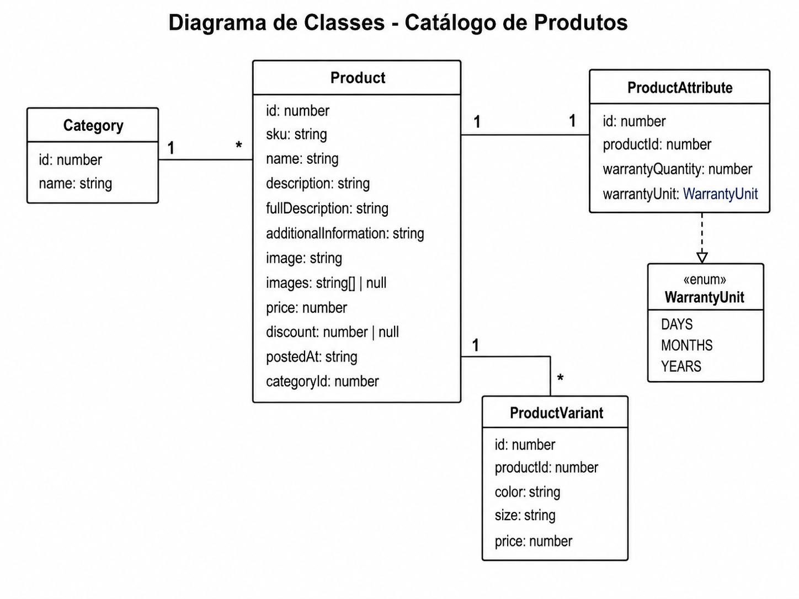

# 🛋️ Furniro

> 📖 [English version](README.en.md) | Versão em Português

Aplicação Full-Stack de e-commerce de móveis desenvolvida com **React**, **NestJS**, **TypeScript**, **TypeORM** e **SQLite**.

<div align="center">


</div>

---

# 📖 Sobre o Projeto

O **Furniro** é uma aplicação Full-Stack que simula uma plataforma moderna de e-commerce especializada em móveis.

O projeto foi desenvolvido para reproduzir funcionalidades comuns encontradas em lojas virtuais reais, utilizando uma arquitetura desacoplada entre frontend e backend, comunicação via API REST e persistência de dados em banco relacional.

O frontend foi desenvolvido em **React** com **TypeScript**, **Vite** e **Tailwind CSS**, oferecendo uma interface moderna, responsiva e componentizada.

O backend utiliza **NestJS**, **TypeORM** e **SQLite**, expondo uma API REST responsável pelo gerenciamento dos produtos, categorias, variantes e atributos.

A aplicação foi construída priorizando:

- ✅ Arquitetura Full-Stack moderna
- ✅ Separação de responsabilidades
- ✅ Código fortemente tipado com TypeScript
- ✅ Componentização e reutilização
- ✅ Arquitetura em camadas no backend
- ✅ Comunicação via API REST
- ✅ Organização escalável do código
- ✅ Docker para desenvolvimento
- ✅ Persistência de dados utilizando SQLite
- ✅ DTOs, Mappers e Repositories para desacoplamento da camada de domínio

---

# ✨ Funcionalidades

## 🛍️ Loja Virtual

- Catálogo completo de produtos
- Página individual de produto
- Navegação por categorias
- Produtos relacionados
- Carrinho de compras
- Seleção de quantidade
- Seleção de variantes do produto
- Seleção de cor
- Seleção de tamanho
- Exibição de descontos
- Produtos recentes
- Informações detalhadas do produto

---

## 🔍 Catálogo

- Listagem paginada
- Paginação via API
- Ordenação dos produtos
- Filtros por categoria
- Filtros por preço
- Filtros por desconto
- Busca por nome
- Consulta utilizando parâmetros de URL

---

## 🎨 Interface

- Layout totalmente responsivo
- Hero Section
- Browse The Range
- Carrossel de inspiração
- Galeria de imagens
- Toasts de feedback
- Página 404
- Navegação entre páginas
- Componentes reutilizáveis
- Ícones SVG
- Animações e transições

---

## 🛒 Carrinho

- Adicionar produtos
- Alterar quantidade
- Remover produtos
- Persistência utilizando Local Storage
- Estado global utilizando Zustand

---

## ⚙️ Backend

- API REST
- Paginação
- Filtros dinâmicos
- Ordenação
- DTOs
- Validação automática
- Repositories
- Services
- Mappers
- Seed automática do banco
- Banco SQLite

---

# 🛠️ Tecnologias

## Frontend

| Tecnologia      | Finalidade              |
| --------------- | ----------------------- |
| React 19        | Construção da interface |
| TypeScript      | Tipagem estática        |
| Vite            | Bundler e Dev Server    |
| Tailwind CSS v4 | Estilização             |
| React Router    | Navegação               |
| Zustand         | Estado global           |
| React Toastify  | Notificações            |
| Splide          | Carrosséis              |

---

## Backend

| Tecnologia        | Finalidade               |
| ----------------- | ------------------------ |
| NestJS            | Framework Backend        |
| TypeScript        | Linguagem                |
| TypeORM           | ORM                      |
| SQLite            | Banco de Dados           |
| Class Validator   | Validação dos DTOs       |
| Class Transformer | Transformação de objetos |

---

## Infraestrutura

| Tecnologia     | Finalidade                  |
| -------------- | --------------------------- |
| Docker         | Containerização             |
| Docker Compose | Orquestração dos containers |
| Node.js        | Ambiente de execução        |

---

# 🏗️ Arquitetura

O projeto foi organizado como um **monorepo**, separando claramente as responsabilidades entre frontend e backend.

```
                ┌───────────────────────────────┐
                │          Frontend             │
                │        React + Vite           │
                └──────────────┬────────────────┘
                               │
                         HTTP / REST
                               │
                               ▼
                ┌───────────────────────────────┐
                │          Backend              │
                │           NestJS              │
                └──────────────┬────────────────┘
                               │
                          TypeORM
                               │
                               ▼
                ┌───────────────────────────────┐
                │          SQLite               │
                └───────────────────────────────┘
```

O frontend consome exclusivamente a API REST disponibilizada pelo backend.

Toda a lógica de acesso aos dados permanece centralizada na aplicação NestJS, responsável pela consulta ao banco de dados, aplicação de filtros, paginação e transformação das entidades antes do envio ao cliente.

---

## Arquitetura do Backend

O backend segue uma arquitetura em camadas, favorecendo baixo acoplamento e alta manutenibilidade.

```
Controller
     │
     ▼
Service
     │
     ▼
Repository
     │
     ▼
TypeORM
     │
     ▼
SQLite
```

Cada camada possui uma responsabilidade específica:

- **Controller**
    - Recebe as requisições HTTP.
    - Valida os parâmetros.
    - Encaminha as chamadas para os Services.

- **Service**
    - Implementa as regras de negócio.
    - Coordena consultas e transformações.

- **Repository**
    - Centraliza o acesso ao banco de dados.
    - Implementa filtros, paginação e ordenação.

- **Mapper**
    - Converte entidades do banco em DTOs enviados pela API.

- **DTO**
    - Define o contrato da API.
    - Evita exposição direta das entidades.

---

# 📂 Estrutura do Projeto

```text
/
├── CONTRIBUTING.en.md
├── CONTRIBUTING.md
├── docker-compose.yml
├── LICENSE
├── README.en.md
├── README.md
├── SECURITY.en.md
├── SECURITY.md
├── furniro-back-end/
│   ├── Dockerfile
│   ├── eslint.config.mjs
│   ├── nest-cli.json
│   ├── package.json
│   ├── README.md
│   ├── tsconfig.build.json
│   ├── tsconfig.json
│   └── src/
│       ├── app.controller.ts
│       ├── app.module.ts
│       ├── main.ts
│       ├── category/
│       │   ├── category.entity.ts
│       │   ├── category.module.ts
│       │   └── dto/
│       │       └── category.dto.ts
│       ├── database/
│       │   └── seed.ts
│       └── product/
│           ├── product.controller.ts
│           ├── product.module.ts
│           ├── product.service.ts
│           ├── dto/
│           │   ├── product-attribute.dto.ts
│           │   ├── product-details.dto.ts
│           │   ├── product.dto.ts
│           │   ├── product-variant.dto.ts
│           │   └── products-filters.dto.ts
│           ├── entities/
│           │   ├── product-attribute.entity.ts
│           │   ├── product-variant.entity.ts
│           │   └── product.entity.ts
│           ├── mappers/
│           │   └── product.mapper.ts
│           └── repositories/
│               └── product.repository.ts
└── furniro-web/
    ├── Dockerfile
    ├── eslint.config.js
    ├── index.html
    ├── package.json
    ├── README.en.md
    ├── README.md
    ├── tsconfig.app.json
    ├── tsconfig.json
    ├── tsconfig.node.json
    ├── vite.config.ts
    ├── db/
    │   └── db.json
    ├── public/
    │   ├── icons/
    │   └── img/
    │       ├── grid/
    │       └── products/
    └── src/
        ├── App.tsx
        ├── index.css
        ├── main.tsx
        ├── api/
        │   └── api.ts
        ├── components/
        │   ├── Badge.tsx
        │   ├── BannerContainer.tsx
        │   ├── BreadcrumbProduct.tsx
        │   ├── BrowseSection.tsx
        │   ├── Carrousel.tsx
        │   ├── CarrouselSlide.tsx
        │   ├── CartButton.tsx
        │   ├── CartTotals.tsx
        │   ├── Container.tsx
        │   ├── FeaturesSection.tsx
        │   ├── FilterBar.tsx
        │   ├── Footer.tsx
        │   ├── FormNewsletter.tsx
        │   ├── FuniroFurnitureSection.tsx
        │   ├── Header.tsx
        │   ├── Hero.tsx
        │   ├── InfinityGallery.tsx
        │   ├── InspirationSection.tsx
        │   ├── Layout.tsx
        │   ├── Logo.tsx
        │   ├── MainBtn.tsx
        │   ├── Nav.tsx
        │   ├── Pagination.tsx
        │   ├── PrincipalGrid.tsx
        │   ├── ProductCard.tsx
        │   ├── ProductCardSkeleton.tsx
        │   ├── ProductGallery.tsx
        │   ├── ProductImageThumbnail.tsx
        │   ├── ProductMainImage.tsx
        │   ├── ProductsSection.tsx
        │   ├── UserAndCartIcon.tsx
        │   └── product-details/
        │       ├── ProductDetailsContainer.tsx
        │       ├── ProductInfo.tsx
        │       └── ...
        ├── data/
        │   ├── grid.ts
        │   └── slides.ts
        ├── hooks/
        │   ├── get-product.ts
        │   └── get-products.ts
        ├── models/
        │   ├── PaginatedResponseModel.ts
        │   ├── ProductAttributeModel.ts
        │   ├── ProductCategory.ts
        │   ├── ProductDetailModel.ts
        │   ├── ProductFilterModel.ts
        │   ├── ProductModel.ts
        │   ├── ProductResponseModel.ts
        │   ├── ProductVariantModel.ts
        │   └── slide.ts
        ├── pages/
        │   ├── Cart.tsx
        │   ├── Home.tsx
        │   ├── NotFound.tsx
        │   ├── Product.tsx
        │   └── Shop.tsx
        ├── services/
        │   ├── api.ts
        │   └── ProductService.ts
        ├── store/
        │   └── cartStore.ts
        └── types/
            └── splide.d.ts
```

## Organização do Frontend

A estrutura do frontend segue o princípio de separação por responsabilidade:

- **components/** → Componentes reutilizáveis da interface.
- **pages/** → Páginas da aplicação.
- **services/** → Comunicação com a API.
- **hooks/** → Hooks customizados.
- **store/** → Estado global utilizando Zustand.
- **models/** → Contratos TypeScript.
- **api/** → Configuração do cliente HTTP.

---

## Organização do Backend

O backend é organizado por módulos.

Cada módulo concentra suas próprias entidades, DTOs, repositórios, serviços e controladores, mantendo alta coesão e facilitando a evolução da aplicação.

A camada de acesso aos dados foi isolada através de **Repositories**, enquanto os **Services** concentram toda a lógica de negócio e os **Controllers** permanecem responsáveis apenas pelo tratamento das requisições HTTP.

# 📊 Modelo de Dados

O backend foi modelado utilizando **TypeORM**, com persistência em **SQLite**, organizando os dados em entidades relacionadas.

A estrutura foi projetada para permitir a evolução do catálogo de produtos, possibilitando que um mesmo produto possua diferentes variantes, atributos e categoria.

---

## Diagrama de Relacionamento



---

# 🌐 API REST

Toda a comunicação entre frontend e backend acontece através de uma API REST construída com NestJS.

O frontend não acessa diretamente o banco de dados, consumindo exclusivamente os endpoints disponibilizados pela aplicação backend.

---

## Base URL

```text
http://localhost:3000
```

No frontend, a URL da API é configurada através da variável de ambiente:

```env
VITE_API_URL=http://localhost:3000
```

---

# 📌 Endpoints

## Health Check

Retorna uma mensagem indicando que a API está em funcionamento.

### Requisição

```http
GET /
```

---

## Listar Produtos

Retorna os produtos cadastrados aplicando filtros, paginação e ordenação.

### Requisição

```http
GET /products
```

### Query Params

| Parâmetro   | Tipo        | Descrição             |
| ----------- | ----------- | --------------------- |
| page        | number      | Página desejada       |
| limit       | number      | Quantidade por página |
| name        | string      | Busca por nome        |
| category    | string      | Categoria             |
| price_gte   | number      | Preço mínimo          |
| price_lte   | number      | Preço máximo          |
| discount    | number      | Desconto exato        |
| discount_gt | number      | Desconto mínimo       |
| sort        | string      | Campo de ordenação    |
| order       | asc \| desc | Direção da ordenação  |

---

### Exemplo

```http
GET /products?page=1&limit=8
```

```http
GET /products?category=Dining
```

```http
GET /products?price_gte=500&price_lte=1000
```

```http
GET /products?discount_gt=20
```

---

### Resposta

```json
{
    "products": [
        {
            "id": 1,
            "name": "Syltherine",
            "price": 2500,
            "discount": 30
        }
    ],
    "page": 1,
    "limit": 8,
    "total": 32,
    "hasMore": true
}
```

---

## Buscar Produto

Retorna todos os detalhes de um produto.

### Requisição

```http
GET /products/:id/slug
```

### Exemplo

```http
GET /products/1/syltherine
```

---

### Resposta

```json
{
    "id": 1,
    "sku": "SYL001",
    "name": "Syltherine",
    "description": "...",
    "price": 2500,
    "discount": 30,
    "category": {
        "id": 1,
        "name": "Dining"
    },
    "attributes": {
        "warrantyQuantity": 3,
        "warrantyUnit": "Years"
    },
    "variants": [
        {
            "color": "Black",
            "size": "L",
            "price": 2500
        }
    ]
}
```

---

# 🔄 Fluxo de Dados

O fluxo completo da aplicação pode ser representado da seguinte forma:

```text
Usuário
   │
   ▼
React Components
   │
   ▼
Hooks
   │
   ▼
Services
   │
HTTP
   │
   ▼
NestJS Controller
   │
   ▼
Service
   │
   ▼
Repository
   │
   ▼
SQLite
```

Cada camada possui uma responsabilidade específica:

- **Componentes** renderizam a interface.
- **Hooks** encapsulam regras de consumo da API.
- **Services** realizam as requisições HTTP.
- **Controllers** recebem as requisições.
- **Services** implementam as regras de negócio.
- **Repositories** consultam o banco de dados.

---

# 🐳 Docker

O projeto pode ser executado integralmente utilizando Docker Compose.

Os dois serviços são iniciados automaticamente:

- Frontend (React + Vite)
- Backend (NestJS)

O banco SQLite é utilizado diretamente pelo backend.

---

## Estrutura

```text
docker-compose
        │
        ├──────────────┐
        │              │
        ▼              ▼
Frontend          Backend
React             NestJS
Vite              SQLite
```

---

## Containers

| Serviço  | Porta |
| -------- | ----- |
| Frontend | 5173  |
| Backend  | 3000  |

---

## Executando

Na raiz do projeto:

```bash
docker compose up --build
```

Após a inicialização:

| Serviço  | URL                   |
| -------- | --------------------- |
| Frontend | http://localhost:5173 |
| Backend  | http://localhost:3000 |

Durante a inicialização do backend, o banco de dados é populado automaticamente através da seed da aplicação.

---

# 🚀 Executando o Projeto

## Pré-requisitos

- Node.js 18 ou superior
- npm
- Docker (opcional)

---

# Executando Localmente

## 1. Clone o repositório

```bash
git clone https://github.com/Duda-Martins/furniro-web2.git
```

```bash
cd furniro-web2
```

---

## 2. Backend

Entre na pasta:

```bash
cd furniro-back-end
```

Instale as dependências:

```bash
npm install
```

Execute a seed do banco:

```bash
npm run seed
```

Inicie a aplicação:

```bash
npm run start:dev
```

A API estará disponível em:

```text
http://localhost:3000
```

---

## 3. Frontend

Em outro terminal:

```bash
cd furniro-web
```

Instale as dependências:

```bash
npm install
```

Configure o arquivo `.env`:

```env
VITE_API_URL=http://localhost:3000
```

Inicie o servidor de desenvolvimento:

```bash
npm run dev
```

O frontend estará disponível em:

```text
http://localhost:5173
```

---

## Execução utilizando Docker

Na raiz do projeto:

```bash
docker compose up --build
```

Esse comando:

- cria os containers;
- instala as dependências;
- executa a seed do banco de dados;
- inicia backend e frontend;
- disponibiliza toda a aplicação pronta para uso.

# ⚙️ Scripts Disponíveis

## Frontend

Os principais scripts disponíveis no frontend são:

| Script            | Descrição                                     |
| ----------------- | --------------------------------------------- |
| `npm run dev`     | Inicia o servidor de desenvolvimento com Vite |
| `npm run build`   | Gera o build de produção                      |
| `npm run preview` | Executa o build localmente                    |
| `npm run lint`    | Executa o ESLint para análise do código       |

---

## Backend

Os scripts disponíveis no backend são:

| Script                | Descrição                                      |
| --------------------- | ---------------------------------------------- |
| `npm run start`       | Inicia a aplicação                             |
| `npm run start:dev`   | Executa em modo desenvolvimento com Hot Reload |
| `npm run start:debug` | Executa em modo debug                          |
| `npm run start:prod`  | Executa a versão compilada                     |
| `npm run build`       | Compila o projeto                              |
| `npm run seed`        | Popula o banco de dados                        |
| `npm run lint`        | Executa o ESLint                               |
| `npm run format`      | Formata o código utilizando Prettier           |
| `npm run test`        | Executa os testes                              |
| `npm run test:watch`  | Executa os testes em modo watch                |
| `npm run test:cov`    | Gera relatório de cobertura                    |
| `npm run test:e2e`    | Executa os testes End-to-End                   |

---

# 🌱 Banco de Dados

O projeto utiliza **SQLite** como banco de dados principal.

Durante o desenvolvimento, os dados são criados automaticamente através de uma **Seed**, permitindo que a aplicação esteja pronta para uso imediatamente após sua inicialização.

A seed é responsável por cadastrar:

- Categorias;
- Produtos;
- Variantes;
- Atributos;
- Relações entre as entidades.

Para executá-la manualmente:

```bash
npm run seed
```

---

# 🔧 Variáveis de Ambiente

## Frontend

Arquivo:

```text
furniro-web/.env
```

Conteúdo:

```env
VITE_API_URL=http://localhost:3000
```

| Variável       | Descrição                                   |
| -------------- | ------------------------------------------- |
| `VITE_API_URL` | URL base utilizada para consumir a API REST |

---

## Backend

Atualmente o backend utiliza apenas uma variável de ambiente.

| Variável | Padrão | Descrição          |
| -------- | ------ | ------------------ |
| `PORT`   | 3000   | Porta da aplicação |

Caso nenhuma porta seja informada, o backend será iniciado utilizando a porta **3000**.

---

# 📁 Organização do Código

O projeto foi estruturado priorizando organização, reutilização e facilidade de manutenção.

## Frontend

```text
Pages
   │
   ▼
Components
   │
   ▼
Hooks
   │
   ▼
Services
   │
   ▼
API
```

### Responsabilidades

**Pages**

Representam as páginas da aplicação e são responsáveis apenas por compor a interface.

**Components**

Componentes reutilizáveis e independentes.

**Hooks**

Centralizam regras de carregamento de dados e estados derivados.

**Services**

Responsáveis pela comunicação com a API.

**Models**

Definem os contratos TypeScript utilizados pela aplicação.

**Store**

Centraliza o gerenciamento do carrinho utilizando Zustand.

---

## Backend

```text
Controller
     │
     ▼
Service
     │
     ▼
Repository
     │
     ▼
Entity
```

### Controller

Recebe as requisições HTTP e retorna as respostas.

### Service

Implementa toda a regra de negócio.

### Repository

Centraliza todas as consultas ao banco de dados.

### Entity

Representa a estrutura persistida no banco.

### DTO

Define os contratos da API.

### Mapper

Converte entidades em objetos de resposta.

---

# 💡 Decisões de Arquitetura

Algumas decisões foram tomadas visando escalabilidade, organização e facilidade de manutenção do projeto.

## TypeScript em toda a aplicação

Toda a aplicação foi escrita utilizando TypeScript para aumentar a segurança durante o desenvolvimento, reduzir erros em tempo de execução e melhorar a experiência de desenvolvimento.

---

## Arquitetura em Camadas

O backend segue uma arquitetura em camadas, separando claramente:

- acesso HTTP;
- regras de negócio;
- acesso ao banco;
- contratos da API.

Essa organização reduz o acoplamento entre as partes da aplicação.

---

## Repositories

O acesso ao banco foi isolado em classes específicas de repositório.

Isso facilita:

- reutilização de consultas;
- manutenção;
- criação de testes;
- troca futura da tecnologia de persistência.

---

## DTOs

Os DTOs garantem que apenas os dados necessários sejam expostos pela API.

Além disso, permitem validação automática utilizando `ValidationPipe`.

---

## Mappers

Os Mappers desacoplam as entidades do banco das respostas enviadas pela API.

Essa abordagem evita expor detalhes internos da aplicação e facilita futuras alterações no modelo de dados.

---

## Zustand

O carrinho utiliza Zustand para gerenciamento de estado global.

Entre as vantagens estão:

- simplicidade;
- baixo custo de manutenção;
- excelente desempenho;
- persistência em Local Storage.

---

## Docker

A aplicação pode ser executada integralmente através do Docker Compose.

Isso garante um ambiente consistente entre diferentes máquinas e simplifica o processo de configuração.

---

# 📝 Licença

Este projeto é distribuído sob a licença **MIT**.

Consulte o arquivo **LICENSE** para mais informações.

---

# 👥 Autores

<div align="center">

<div style="display:flex; flex-wrap:wrap; justify-content:center; gap:32px;">

<div align="center">


### Emanuelly Rackel

Full-Stack Developer

[GitHub](https://github.com/codesmanu)

[LinkedIn](https://www.linkedin.com/in/emanuelly-rackel/)

📧 contact.rackel@gmail.com

</div>

<div align="center">


### Rogério Luiz Nunes de Andrade

Full-Stack Developer

[GitHub](https://github.com/ItsMeRoger001)

[LinkedIn](https://www.linkedin.com/in/rogerioluiz-andrade/)

📧 rogerioandrade3212@gmail.com

</div>

<div align="center">


### Pedro Lucas

Full-Stack Developer

[GitHub](https://github.com/P3DROVFX)

[LinkedIn](https://www.linkedin.com/in/pedro-lucas-549477237/)

📧 pedrolucasmunizpessoa@gmail.com

</div>

<div align="center">


### Carlos Eduardo do Nascimento

Full-Stack Developer

[GitHub](https://github.com/usuario4)

[LinkedIn](https://www.linkedin.com/in/carlos-eduardo-ns/)

📧 doardo.ns@gmail.com

</div>

<div align="center">


### Maria Eduarda Rodrigues

Full-Stack Developer

[GitHub](https://github.com/Duda-Martins)

[LinkedIn](https://linkedin.com/in/maria-eduarda-martins-rodrigues)

📧 mrodrigues.mariaeduarda@gmail.com

</div>

</div>

</div>

---

<div align="center">

### ⭐ Se este projeto foi útil para você, considere deixar uma estrela no repositório!

**Obrigado por visitar este projeto!**

Desenvolvido com ❤️ utilizando React, NestJS e TypeScript.

</div>
